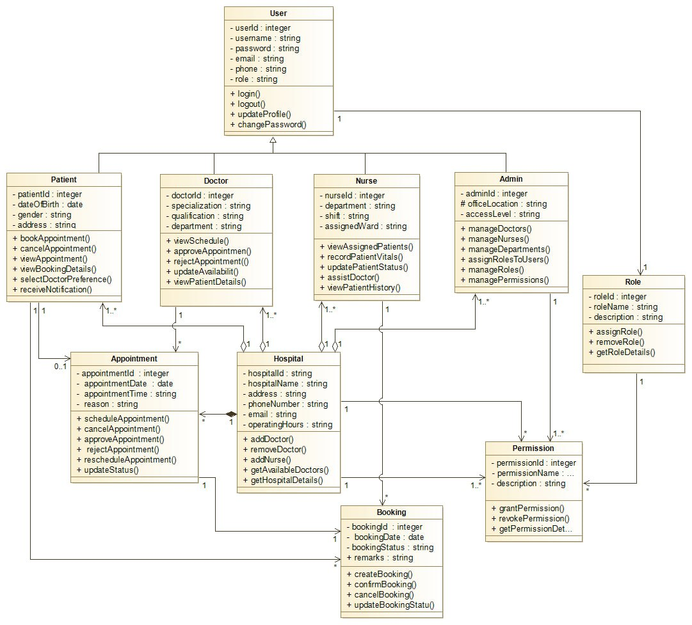

# Hospital-Appointment-Management-System
## Project Overview

The Hospital Appointment Management System is an academic software engineering project developed to model and understand how appointment-related activities in a hospital environment can be managed using object-oriented principles and UML modeling techniques. The project focuses on system understanding, modeling, and structural code generation rather than full deployment or implementation.

## Brief Description of the Overall Project

This project addresses the problem of inefficient hospital appointment management, where manual or poorly coordinated systems often result in long patient waiting times, overlapping appointments, and overburdened medical staff. The problem was selected because appointment scheduling is a critical hospital operation that directly affects service quality, patient satisfaction, and staff productivity. To address this issue, the project proposes a Hospital Appointment Management System that models how patients, doctors, nurses, and administrators interact to manage appointments, schedules, and roles in an organized manner. The main goal of the project is to design and model this system using object-oriented principles and UML, and to generate initial Java structural code that reflects a clear and well-understood system design.
## The objectives of this project are to:

- Design and model a Hospital Appointment Management System using object-oriented principles.
- Reduce long waiting times and avoid overlapping or overloaded appointments through proper system modeling.
- Clearly define user roles such as patient, doctor, nurse, and administrator.
- Represent system structure and behavior using UML diagrams.
- Generate initial Java structural code from the UML class diagram.
- Demonstrate clear system understanding rather than full system deployment.
## Scope of the Project
The proposed system is intended to:
- Model hospital appointment workflows using UML diagrams.
- Define system structure through class diagrams and relationships.
- Represent system behavior using use case, sequence, and activity diagrams.
- Generate initial Java code for the structural components of the system.

The project does not include user interface development, database implementation, testing, or system deployment.
### Software Development Approach

The project follows a model-driven, object-oriented development approach. The system is first analyzed and understood through requirement identification. UML diagrams are then used to model the structure (class diagram) and behavior (use case, sequence, and activity diagrams) of the system. Finally, initial Java code is generated for the structural components, demonstrating the connection between design and implementation.

### Development Practices Applied

- Object-Oriented Analysis and Design (OOAD): Classes, inheritance, and associations are carefully defined.
- Encapsulation and abstraction: Attributes are private, and methods are public.
- UML-based modeling: Ensures clarity, correctness, and traceability.
- Model-to-Code generation: Structural code is automatically produced from the class diagram.

### Tools and Technologies Used and Rationale

- UML Lab: Used for creating the class diagram and generating initial Java code. Chosen for its strong model-to-code support and academic reliability.
- Draw.io: Used for use case, sequence, and activity diagrams due to its flexibility and ease of use for professional-looking diagrams.
- Java: Selected as the implementation language for code generation because of its robust object-oriented support and widespread use.
- Hardware: Standard personal computer capable of running Java and modeling tools.
## Project Initiation and System Understanding

The project began with system understanding using requirement engineering concepts. The hospital environment was analyzed to identify key actors, entities, and workflows.

## System Structure Identification

The system is structured around core entities such as Hospital, User, Appointment, and Booking. Specialized users (Patient, Doctor, Nurse, Admin) inherit from the User class, while authorization is handled through Role and Permission classes.
 
## System Behavior Identification

System behavior includes appointment booking, approval workflows, role-based access control, and interaction among hospital staff.

## Object-Oriented Analysis

Object orientation was applied to identify classes, attributes, methods, and relationships. Inheritance, associations, and encapsulation were carefully used to reflect real-world hospital operations.

## System Modeling

The system is modeled using UML diagrams to represent different perspectives:

- Use Case Diagram: Shows interactions between actors and the system.
- Class Diagram: Represents the static structure of the system and relationships among classes.
- Sequence Diagram: Illustrates interaction flow for key scenarios such as appointment booking and approval.
- Activity Diagram: Describes workflow of major system processes.
- These models ensure a complete and well-understood system before any code generation.

## Code Generation

Based on the finalized class diagram, initial Java code was generated using the Java Designer module in Modelio. The generated code includes class definitions, attributes, method signatures, and inheritance relationships. Only structural aspects are covered, and method bodies are intentionally left with minimal or placeholder implementations, as the focus of the project is modeling rather than full development.

## Conclusion

This project demonstrates the application of software engineering principles through systematic analysis, modeling, and structural code generation. By focusing on UML-based design and object-oriented concepts, the Hospital Appointment Management System provides a clear and well-organized representation of hospital operations suitable for academic evaluation.

## References

- Software Engineering Tools & Practices – Group Project Submission Guideline
- UML Specification and Object-Oriented Design Principles
- Modelio Documentation
